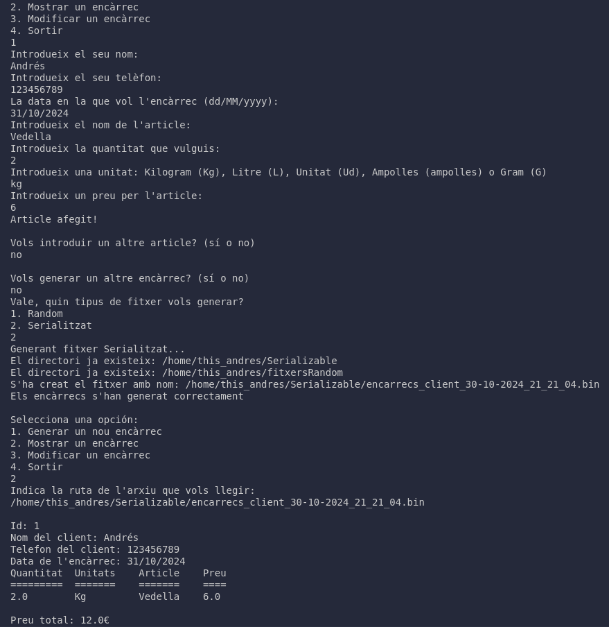
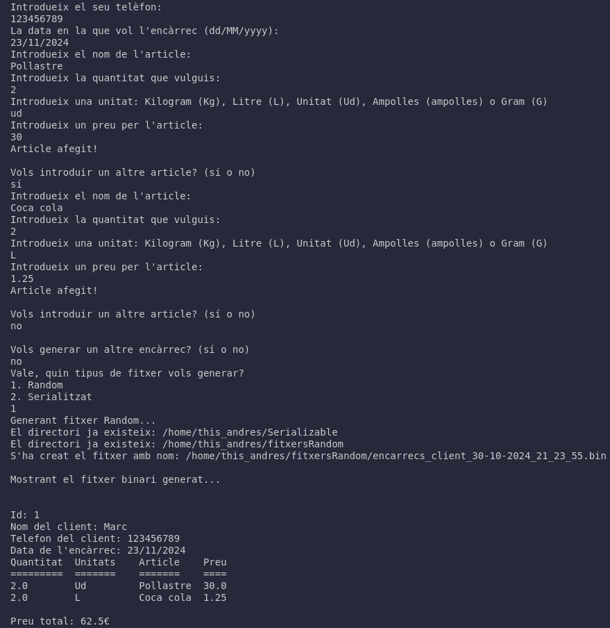
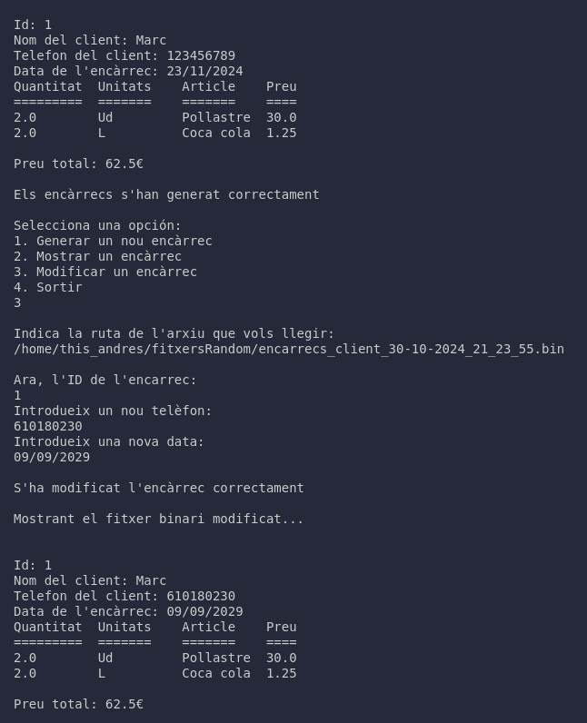

# Encarrecs d'una botiga

Aquesta petita aplicació serveix com a gestor d'encàrrecs d'una botiga, on cada client pot fer els encàrrecs que vulgui. Els encàrrecs es gestionen mitjançant diferents classes i es guarden en diferents formats: un fitxer binari amb accés aleatori i un fitxer binari serialitzat.

## Contingut
- Descripció del programa
- Classes del programa
- Com funciona?
- Funcionament intern del programa
- Crèdits

## Descripció del programa
Aquest programa permet als usuaris gestionar encàrrecs, incloent la creació d'articles amb diverses unitats, la validació de dades d'entrada i l'emmagatzematge de les dades en formats de fitxer diferenciats. Inclou la funcionalitat per generar un fitxer binari amb accés aleatori i un fitxer binari serialitzat.

## Classes del programa

### 1. Article
La classe Article conté les propietats d'un article dins d'una comanda d'un client. Les seves propietats inclouen:
- **nom**: El nom de l'article.
- **unitat**: La unitat de mesura de l'article, representada per l'enum Unitat.
- **quantitat**: La quantitat de l'article.
- **preu**: El preu unitari de l'article.

**Mètodes destacats**:
- `toString()`: Retorna una representació textual de l'article.
- `toCSV()`: Retorna una representació en format CSV de l'article.

### 2. Unitat
L'enum Unitat defineix les diferents unitats que es poden utilitzar per mesurar articles, com ara KILO, LITRE, UNITAT, AMPOLLES i GRAM.

**Mètodes destacats**:
- `fromString(String nom)`: Converteix una cadena a una unitat, llençant una excepció si la cadena no és vàlida.

### 3. UtilString
La classe UtilString inclou mètodes utilitaris per manipular cadenes de text, incloent la normalització de noms.

**Mètodes destacats**:
- `normalitzaString(String cadena)`: Normalitza un nom permitint només espais entre lletres i lletres, llençant excepcions si la cadena no és vàlida.

### 4. Encarrec
La classe Encarrec representa un encàrrec d'un client, incloent el id de l'encàrrec,nom del client, telèfon, data, llista d'articles i el preu total.

**Mètodes destacats**:
- `calcularPreuTotal()`: Calcula el preu total de l'encarrec a partir del preu de l'article i la seva quantitat.
- `reiniciarId()`: Reinicia l'ID de l'encàrrec cada vegada que es cridat. Normalment, s'utilitzaria per generar un ID nou cada vegada que fem un fitxer nou.

### 5. Gestor
La classe Gestor s'encarrega de la creació de directoris, i l'escriptura i lectura de fitxers en els diferents formats.

**Mètodes destacats**:
- `crearDirectoris()`: Crea directoris per emmagatzemar fitxers.
- `EscriureEncarrecRandom(ArrayList<Encarrec> encarrecs)`: Escriu un fitxer binari amb accés aleatori a partir d'una llista d'encàrrecs.
- `modificarEncarrec(String ruta, int id)`: Modifica el telèfon i la data de lliurament d'un encàrrec accedint a cada encàrrec per la seva ID de manera aleatòria.
- `LlegirBinariRandom(String ruta)`: Llegeix un fitxer binari amb accés aleatori.
- `EscriureEncarrecSerialitzable(ArrayList<Encarrec> encarrecs)`: Serialitza i guarda una llista d'encàrrecs en un fitxer binari, utilitzant *ObjectOutputStream* per escriure la llista a la ruta especificada.
- `LlegirEncarrecSerialitzable(String ruta)`: Llegeix i deserialitza una llista d'encàrrecs a partir d'un fitxer, convertint l'objecte sencer en una llista d'encàrrecs. Per cada encàrrec, crida al mètode *calcularPreuTotal()* i imprimeix un albarà a la consola.
- `generarAlbara(Encarrec encarrec)`: Genera un albarà amb les dades de l'encàrrec que li passem per paràmetres.

### 6. Main
La classe Main és el punt d'entrada de l'aplicació i gestiona la interacció amb l'usuari a través d'un menú de comandament per gestionar encàrrecs.

## Com funciona?
- **Generació d'encàrrecs**: L'usuari pot crear un nou encàrrec introduint el nom del client, telèfon, data, articles i preu.
- **Generació de fitxers**: Un cop creat, l'encàrrec es pot desar com a fitxer binari amb accés aleatori o com a fitxer binari serialitzat.
- **Lectura de fitxers**: L'usuari pot deserialitzar els fitxers que ha serialitzat anteriorment.
- **Modificació d'encàrrecs**: L'usuari pot modificar tant el telèfon del client com la data de lliurament de l'encàrrec cercant per l'ID de l'encàrrec.

## Funcionament Intern del Programa

### 1. Inicialització del Programa
En iniciar el programa, s'executa la classe `Main`, que presenta un menú a l'usuari amb diverses opcions per gestionar els encàrrecs.

### 2. Entrada de Dades
L'usuari pot introduir les dades de l'encàrrec:
- **Nom del client**: S'ha de proporcionar un nom que es normalitzarà per eliminar espais innecessaris.
- **Telèfon**: Ha de tenir exactament 9 dígits i només es permeten números.
- **Data**: Es demana a l'usuari que introdueixi una data futura en format `dd/MM/yyyy`.
- **Articles**: Cada article es crea a partir de la classe `Article`, que requereix especificar el nom, la unitat (Kg, L, Ud, ampolles o G), la quantitat i el preu.

### 3. Validació de Dades
Es fan servir mètodes de la classe `UtilString` per validar i normalitzar les entrades, assegurant que les dades siguin correctes. Per exemple:
- El nom del client no ha de ser buit.
- El telèfon ha de ser de nou dígits i només pot contenir números.
- La data ha de ser posterior a la data actual.
- La quantitat i el preu dels articles han de ser majors que zero.

### 4. Creació de l'Encàrrec
Un cop recollides les dades, es crea un objecte de la classe `Encarrec`, on s'emmagatzema la informació del client i els articles afegits. Els encarrecs són identificats per un ID únic generat automàticament, i es poden realitzar operacions com afegir més articles a la llista.

### 5. Generació de Documents
Al finalitzar l'entrada de dades, el programa permet a l'usuari generar documents en diferents formats:
- **Fitxers**: Els encarrecs es poden guardar en fitxers binaris (usant `RandomAccessFile`) o fitxers serialitzables (usant `ObjectOutputStream`), permetent una gestió més eficient i estructurada de les dades.

### 6. Modificació d'Encàrrecs
Els encarrecs existents poden ser modificats. L'usuari pot especificar un ID d'encàrrec i canviar el telèfon o la data associada a aquest encàrrec. Les modificacions es realitzen mitjançant el mètode `modificarEncarrec` de la classe `Gestor`.

### 7. Lectura de Fitxers
El programa permet llegir encarrecs des de fitxers binaris serialitzats. El mètode `LlegirEncarrecSerialitzable` recupera les dades d'encarrecs emmagatzemades i les mostra per consola, incloent tota la informació rellevant.

### 8. Gestió d'Errors
El programa gestiona errors mitjançant excepcions, proporcionant retroalimentació a l'usuari quan s'introdueixen dades incorrectes. Les excepcions es llancen per condicions com:
- Telèfons incorrectes.
- Dates passades.
- Entrades buides per a noms i articles.
- Unitats incorrectes.
- Quantitats inferiors o iguals a 0.
- Preu inferior o igual a 0.

## Proves

## Crèdits
Desenvolupat per Andrés González.
